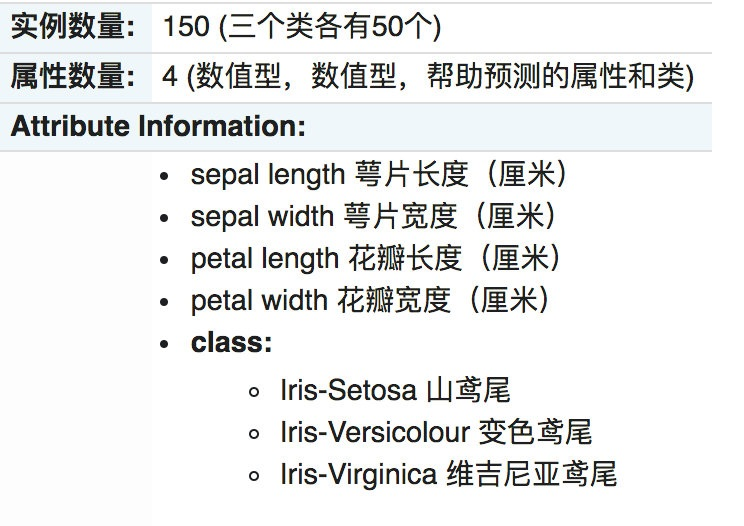

# 1.鸢尾花种类预测  
## 1.1 数据集来源
    Iris数据集是常⽤的分类实验数据集，由Fisher, 1936收集整理。Iris也称鸢尾花卉数据集，是⼀类多重变量分析的数据集。关于数据集的具体介绍：

## 1.2  步骤分析
>+ 1.获取数据集  
>+ 2.数据基本处理  
>+ 3.特征⼯程  
>+ 4.机器学习(模型训练)  
5.模型评估  
## 1.3  代码过程
>+ 导⼊模块  
````python
from sklearn.datasets import load_iris
from sklearn.model_selection import train_test_split
from sklearn.preprocessing import StandardScaler
from sklearn.neighbors import KNeighborsClassifier
````
>+ 先从sklearn当中获取数据集，然后进⾏数据集的分割  
````python
# 1.获取数据集
iris = load_iris()
# 2.数据基本处理
# x_train,x_test,y_train,y_test为训练集特征值、测试集特征值、训练集⽬标值、测试集⽬标值
x_train, x_test, y_train, y_test = train_test_split(iris.data, iris.target, test_size=0.2, random_state=22)
````
>+ 进⾏数据标准化
>>+ 特征值的标准化  
````python
        # 3、特征⼯程：标准化
        transfer = StandardScaler()
        x_train = transfer.fit_transform(x_train)
        x_test = transfer.transform(x_test)
````
>+ 模型进⾏训练预测  
 ````python
    # 4、机器学习(模型训练)
    estimator = KNeighborsClassifier(n_neighbors=9)
    estimator.fit(x_train, y_train)
    # 5、模型评估
    # ⽅法1：⽐对真实值和预测值
    y_predict = estimator.predict(x_test)
    print("预测结果为:\n", y_predict)
    print("⽐对真实值和预测值：\n", y_predict == y_test)
    # ⽅法2：直接计算准确率
    score = estimator.score(x_test, y_test)
    print("准确率为：\n", score)
````